# AutoKing — Playbook: de buscar el lead a entregar el producto

> Proceso operativo completo, con tiempos estimados de entrega por plan.
> Última actualización: 2026-07-23.
> Los tiempos son **días hábiles** y son estimaciones — el reloj de entrega arranca cuando hay **pago + info del negocio recibida**.

---

## 1. El flujo completo de un vistazo

```mermaid
flowchart LR
    subgraph COMERCIAL["🎯 Comercial (captar → cerrar)"]
        A[1. Buscar / captar lead] --> B[2. Calificar]
        B --> C[3. Demo con King]
        C --> D[4. Cerrar venta]
    end
    D --> E[5. 💳 Cobrar instalación]
    subgraph ENTREGA["🚀 Entrega (cobrar → activar)"]
        E --> F[6. Alta del cliente]
        F --> G[7. Onboarding: info del negocio]
        G --> H[8. Conectar WhatsApp]
        H --> I[9. Provisionar agente]
        I --> J[10. Cargar conocimiento]
        J --> K[11. Pruebas / QA]
        K --> L[12. ✅ Activar]
    end
    L --> M[13. Operación y soporte]
```

**Dos mitades.** Antes del pago: convencemos. Después del pago: entregamos. El **pago de la instalación** es la línea que separa vender de construir.

---

## 2. Fase comercial — de lead frío a venta cerrada

| # | Etapa | Cómo funciona | Quién | Tiempo típico |
|---|---|---|---|---|
| 1 | **Captar el lead** | 3 vías: (a) **inbound** — la landing capta el formulario; (b) **inbound WhatsApp** — King responde al número de AutoKing; (c) **outbound** — prospección Google Maps (Outscraper) → leads con score → propuesta | Sistema + vendedor | Continuo |
| 2 | **Calificar** | King pregunta rubro, volumen de mensajes y si el negocio trabaja con citas. Guarda el lead con su estado. Regla: sin saber esto, no se recomienda plan | King (o vendedor) | Minutos |
| 3 | **Demo** | **King ES la demo**: el propio agente muestra cómo atiende, da precios (según país), maneja objeciones y usa el argumento del costo por hora vs una recepcionista | King | Minutos–horas |
| 4 | **Cerrar** | King empuja el cierre; cuando el cliente acepta, **escala a una persona** del equipo (email + WhatsApp al asesor) para coordinar alta y pago | King → asesor | Horas–días |

> El grueso de esta fase es **automático** (King trabaja 24/7). El humano entra solo a cerrar y cobrar.

---

## 3. 💳 El puente: cobro de la instalación

- La **instalación se cobra SIEMPRE por adelantado**, antes de construir. Sin excepción.
- Formas: transferencia (marcar "pagado" en el panel) o link de pago (Bold/MercadoPago — en integración).
- **El reloj de entrega arranca acá**, junto con recibir la info del negocio.

---

## 4. Fase de entrega — de cliente que pagó a agente activo

| # | Etapa | Cómo funciona | Automático / Manual | Tiempo |
|---|---|---|---|---|
| 6 | **Alta del cliente** | Se crea la ficha del cliente en el panel (o King la crea al cerrar) | Semi-auto | Minutos |
| 7 | **Onboarding: info del negocio** | El cliente carga sus datos por un **link público** (servicios, precios, horarios, tono) — o los carga el admin. Puede **subir fotos** de su lista de precios/menú (se leen con visión) o documentos de texto | Cliente self-service | **Depende del cliente** (0.5–2 días) |
| 8 | **Conectar WhatsApp** | Se genera un **setup-link de Kapso** (embedded signup de Meta). El cliente autoriza su propio número desde su cuenta — no cambia de número | Cliente self-service | **Depende del cliente** (0.5–2 días) |
| 9 | **Provisionar el agente** | Un clic ("Activar agente") crea el agente real en el servidor, lo conecta al número del cliente (cuenta Kapso + binding), registra el webhook y arma su persona | 1 clic (admin) | Minutos |
| 10 | **Cargar conocimiento** | La info del negocio + fotos + documentos alimentan la memoria del agente (RAG por cliente). Se puede editar cuando sea | Auto desde onboarding | Minutos |
| 11 | **Pruebas / QA** | Se prueba el agente en vivo (se le escribe como un cliente real) hasta que responde bien. Ajustes de persona sin reiniciar nada | Admin + cliente | 0.5–2 días |
| 12 | **Activar** | Se enciende el agente. Queda respondiendo el WhatsApp del cliente 24/7 | 1 clic (admin) | Minutos |
| 13 | **Operación** | Monitoreo del servidor y agentes desde el panel de Infraestructura; visor de conversaciones; se puede apagar la IA sin cortar el WhatsApp | Continuo | — |

**Lo que más depende de otros (no de nosotros):**
- Que el cliente **cargue su info** (etapa 7).
- Que el cliente **conecte su WhatsApp** (etapa 8).
- La **aprobación de plantillas por Meta** para los recordatorios automáticos (planes Pro e Imperio) — no depende de nosotros y suele tardar **1–3 días hábiles**.

---

## 5. ⏱️ Tiempos de entrega por plan

> Días hábiles desde **pago + info del negocio recibida**. El agente atendiendo el WhatsApp (Recepción) suele quedar listo primero; agenda y recordatorios llegan después por la aprobación de Meta.

| Plan | Qué se entrega | Puesta en marcha (atiende WhatsApp) | Entrega completa | Cuello de botella |
|---|---|---|---|---|
| **Básico** — Recepción | Agente atendiendo 24/7, entrenado con el negocio | **2–3 días** | **3–5 días** | Info del cliente + conexión del número |
| **Pro** — Agenda ⭐ | Todo lo del Básico + agenda citas + recordatorios automáticos | 2–3 días | **5–8 días** | Aprobación de plantillas de recordatorio por Meta (+1–3 días) |
| **Imperio** — Ventas | Todo lo del Pro + Instagram + calificación de prospectos + reportes | 2–3 días | **8–12 días** | Meta (plantillas) + conexión de Instagram + armado de reportes |

### Desglose del reloj de entrega (plan Pro, ejemplo)

```mermaid
gantt
    dateFormat  D
    axisFormat  Día %d
    title  Entrega plan Pro (días hábiles)
    section Cliente
    Carga info + conecta WhatsApp     :a1, 1, 2d
    section AutoKing
    Provisionar + persona + conocimiento :a2, after a1, 1d
    Conectar calendario (agenda)         :a3, after a2, 1d
    section Meta
    Aprobación de plantillas recordatorio :a4, after a1, 3d
    section Cierre
    Pruebas / QA con el cliente          :a5, after a3, 1d
    Activación                            :milestone, after a5, 0d
```

> **Nota honesta:** el "atiende WhatsApp en 2–3 días" asume que el cliente carga su info y conecta su número rápido. Si el cliente se demora en eso, el reloj se pausa — no es tiempo nuestro. Por eso el onboarding self-service (link + fotos) está pensado para que el cliente lo haga en minutos.

---

## 6. Qué acelera y qué retrasa la entrega

**Acelera:**
- Cliente que carga su info completa el primer día (link de onboarding + foto de precios).
- Número de WhatsApp Business ya verificado del lado del cliente.
- Plan Básico (no depende de Meta ni de integraciones).

**Retrasa:**
- Cliente que tarda en dar su info o conectar el número (el mayor factor).
- Aprobación de plantillas de Meta para recordatorios (Pro/Imperio).
- Negocio desordenado: si la instalación se pasa de **15 horas** de configuración, se cotiza aparte.
- Integraciones especiales fuera de alcance (se escalan y cotizan).

---

## 7. Checklist de entrega (para el equipo)

**Antes de arrancar a construir:**
- [ ] Instalación cobrada (por adelantado).
- [ ] Ficha del cliente creada.
- [ ] Link de onboarding enviado al cliente.

**Onboarding recibido:**
- [ ] Info del negocio cargada (servicios, precios, horarios, tono).
- [ ] Fotos/documentos subidos y leídos (si aplica).
- [ ] WhatsApp conectado (setup-link completado, número conectado).

**Construcción:**
- [ ] Agente provisionado ("Activar agente"): cuenta Kapso + binding + webhook + persona.
- [ ] Conocimiento cargado en el agente.
- [ ] (Pro/Imperio) Calendario conectado + plantillas de recordatorio enviadas a Meta.
- [ ] (Imperio) Instagram conectado + calificación de prospectos + reportes.

**Salida en vivo:**
- [ ] Pruebas hechas con el cliente hasta que responde bien.
- [ ] Agente activado (respondiendo 24/7).
- [ ] Cliente avisado de que ya está en marcha.

**Post-venta:**
- [ ] Monitoreo activo (panel de Infraestructura).
- [ ] Primer chequeo de resultados a la semana.

---

## 8. Referencias

- Precios y qué incluye cada plan: [ARGUMENTARIO-VENTA.md](./ARGUMENTARIO-VENTA.md)
- Costos y márgenes: [PRECIOS-Y-COSTOS.md](./PRECIOS-Y-COSTOS.md)
- Diseño técnico del proceso (manual/automático, gaps): [PROCESO-FUNNEL-A-ACTIVACION.md](./PROCESO-FUNNEL-A-ACTIVACION.md)
- Arquitectura e infraestructura: [ESTADO-Y-ROADMAP.md](./ESTADO-Y-ROADMAP.md)
