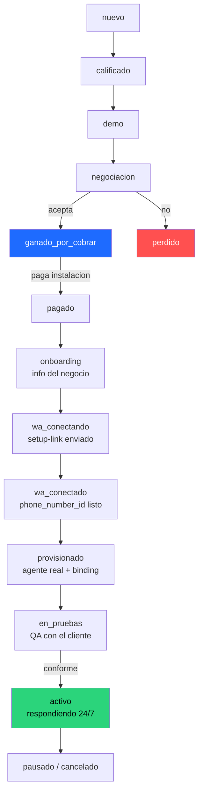

# AutoKing — Proceso completo: del embudo de ventas a la activación total del agente

> Documento de diseño de proceso. Última actualización: 2026-07-22.
> Mapea el journey completo, define cada etapa en modo **manual** y **automático**, y marca qué está **construido** vs **pendiente**.

---

## 0. La idea central

El proceso tiene **dos mitades** que hoy viven separadas y hay que unir:

| Mitad | Va de… | Quién la maneja |
|---|---|---|
| **Embudo comercial** | prospecto frío → cliente que paga | Prospección + King (agente) + vendedor |
| **Activación técnica** | cliente que pagó → agente encendido 24/7 | Admin + Kapso + OpenClaw + infra |

**El puente entre las dos mitades es el pago.** Antes del pago: convencemos. Después del pago: entregamos.

### Principio rector

> Cada etapa tiene **una acción** (crear cliente, generar link, provisionar agente…).
> **Manual** = una persona ejecuta esa acción desde el panel.
> **Automático** = un evento dispara esa MISMA acción sin que nadie la toque.
>
> Por eso primero construimos las acciones (modo manual) y después les colgamos los disparadores (modo automático). **Manual-first, siempre.**

---

## 1. El pipeline completo (máquina de estados)

Un prospecto/cliente atraviesa estos estados. Hoy el estado está desparramado en 3 campos (`leads.status`, `clientes.status`, `clientes.wa_status`). **La propuesta es unificarlo en un solo `pipeline_stage`** para poder ver todo y automatizar.



**Dos hitos que marcan todo:**
- 🔵 **ganado_por_cobrar → pagado**: el puente. Acá termina vender y empieza entregar.
- 🟢 **activo**: el objetivo. El agente del cliente responde su WhatsApp solo.

---

## 2. Etapa por etapa — manual, automático y estado

### MITAD 1 — Embudo comercial

| # | Etapa | Manual (una persona) | Automático (el sistema/King) | Construido |
|---|---|---|---|---|
| 1 | **Captación** | Vendedor carga el lead/prospecto a mano | Landing → form → lead · Prospección Maps → prospects · King responde inbound | ✅ Las 3 vías |
| 2 | **Calificación** | Vendedor lee y etiqueta | King pregunta rubro + volumen + si agenda citas, y guarda el lead con su score | ✅ King califica y guarda |
| 3 | **Demo** | Vendedor hace la demo | **King ES la demo**: el propio agente muestra cómo trabaja, da precios, maneja objeciones | ✅ King |
| 4 | **Negociación / Cierre** | Vendedor cierra | King empuja el cierre; al detectar intención real, escala a una persona | ✅ Tool `escalar` (falta: notificación al equipo robusta) |
| 5 | **Ganado → Cobro** | Vendedor manda datos de pago y confirma la transferencia | Link de pago (Bold/MercadoPago/Stripe) → webhook confirma → avanza solo | ❌ **Sin pago aún** |

### 🔵 PUENTE: el pago de la instalación

### MITAD 2 — Activación técnica

| # | Etapa | Manual (admin) | Automático (el sistema) | Construido |
|---|---|---|---|---|
| 6 | **Alta del cliente** | Admin crea el cliente en `/admin/clientes` | Al confirmarse el pago, se crea el cliente solo (o King lo crea al cerrar) | ✅ CRUD clientes · ✅ King `crear_cliente` (falta: disparo desde pago) |
| 7 | **Onboarding (info del negocio)** | Admin carga servicios, precios, horarios, tono a mano | Formulario que el cliente llena solo → alimenta la persona + RAG | ⚠️ Persona sí, formulario de cliente no |
| 8 | **Conexión de WhatsApp** | Admin genera el setup-link y se lo manda al cliente; toca "Verificar conexión" | Setup-link se auto-envía; webhook de Kapso marca "conectado" al terminar el embedded signup | ✅ Setup-link self-service (falta: auto-envío + webhook) |
| 9 | **Provisioning del agente REAL** | *(hoy no hay forma manual)* | Al detectar el número conectado, se crea el agente real: persona + RAG del negocio + registro en OpenClaw `agents.list` + binding al canal Kapso | ❌ **EL GRAN GAP** (lo que existe solo crea un demo web, no el agente de WhatsApp) |
| 10 | **Entrenamiento / RAG por cliente** | Admin carga el conocimiento del negocio | Del formulario de onboarding se genera el RAG aislado por cliente | ❌ RAG hoy es solo de AutoKing (falta multi-tenant) |
| 11 | **Pruebas (QA)** | Admin/cliente prueban el chat hasta que quede conforme | Script de pruebas automáticas + reporte | ⚠️ Chat de prueba existe (demo web) |
| 12 | **Activación total** | Admin enciende el agente (toggle en infra) | Al pasar QA, se enciende solo | ✅ Toggle en `/admin/infraestructura` |
| 13 | **Operación / Post-venta** | Admin mira infra + conversaciones | Métricas, alertas de caída, aviso de renovación | ✅ Infra + conversaciones (falta: métricas/alertas) |

---

## 3. Diagnóstico: qué tenemos y qué falta

**La mitad comercial está casi entera.** Captamos (3 vías), King califica, demuestra, cierra y guarda. Bien.

**La mitad de activación tiene los huecos grandes**, y son estos cuatro, en orden de importancia:

1. 🔴 **Provisioning del agente real** (etapa 9) — el corazón. Hoy nada conecta "cliente pagó y conectó su número" con "existe un agente que responde SU WhatsApp". Sin esto, todo lo demás no sirve.
2. 🔴 **RAG por cliente** (etapa 10) — cada negocio necesita su propio conocimiento aislado. Hoy el RAG es solo de AutoKing.
3. 🟠 **Cobro** (etapa 5) — hoy es 100% manual (transferencia). Funciona para arrancar, pero es el disparador de toda la mitad 2.
4. 🟠 **Detección automática de conexión** (etapa 8) — hoy hay que apretar "Verificar" a mano; falta el webhook de Kapso.

---

## 4. Cómo lo hacemos: manual primero, automático después

No es "manual **o** automático". Es **manual → automático**, en fases. Cada fase deja el proceso corriendo de punta a punta, cada vez con menos manos.

### Fase A — Que funcione manual, de punta a punta (prioridad)
Poder tomar un cliente real y llevarlo de "pagó" hasta "agente encendido" **a mano desde el panel**, sin scripts sueltos.
- Construir el **provisioning manual del agente real** (botón "Activar agente" en la ficha del cliente cuando su WhatsApp está conectado): registra el agente en OpenClaw + binding al número.
- RAG por cliente básico (cargar el conocimiento del negocio desde la ficha).
- El cobro sigue manual (transferencia, marcás "pagado" a mano).
- **Resultado:** ya podés vender y activar clientes reales HOY, con vos apretando botones.

### Fase B — Unificar el estado y dar visibilidad
- Un solo `pipeline_stage` en la DB + una vista tipo **tablero (kanban)** en el admin donde ves cada cliente/lead en su etapa.
- Cada avance de etapa sigue siendo un botón, pero ahora ves TODO el embudo de un vistazo.
- **Resultado:** control total del proceso, base para automatizar.

### Fase C — Automatizar los disparadores, uno por uno
Con las acciones ya construidas (Fase A) y el estado unificado (Fase B), le colgamos disparadores:
- Webhook de Kapso: número conectado → avanza a "wa_conectado" solo.
- Número conectado → **auto-provisiona** el agente real.
- (Opcional) Link de pago con webhook → "pagado" → arranca el onboarding solo.
- King, al cerrar, crea el cliente y dispara el onboarding.
- **Resultado:** un cliente puede ir de "pagó" a "agente encendido" casi sin manos.

---

## 5. Lo que recomiendo construir primero

**Fase A, empezando por el provisioning del agente real** (etapa 9). Es el gap que hace que TODO lo demás tenga sentido: sin un agente que responda el WhatsApp del cliente, no hay producto entregado.

Concretamente, el primer bloque sería:
1. Extender la **Control API del VPS** con un endpoint `/provision` que registre el agente real en `agents.list` + cree el binding al canal Kapso del `phone_number_id` del cliente.
2. Botón **"Activar agente"** en la ficha del cliente, habilitado cuando `wa_status = conectado`.
3. RAG básico por cliente (el conocimiento del negocio, aislado).
4. El agente activado aparece en el panel de Infraestructura con su toggle.

Con eso, la mitad 2 queda corriendo en modo manual de punta a punta — y recién ahí automatizamos.

---

## 6. Decisiones tomadas

1. **Arrancamos por**: el **provisioning del agente real (manual)** — etapa 9, el gap #1.
2. **Cobro**: **híbrido** — manual (transferencia + marcar "pagado") **y** link de pago Bold. Se construye después del provisioning.
3. **Onboarding de la info del negocio**: **híbrido** — lo puede cargar el admin **o** se envía un link con formulario al cliente, **más un lugar para subir documentos** que alimentan la memoria RAG de cada agente. Se construye después del provisioning.
4. **RAG por cliente**: multi-tenant en la misma `knowledge_base` con columna `cliente_id` (a confirmar en la implementación).

---

## 6-bis. Diseño técnico del provisioning del agente real (confirmado en el VPS)

Investigado y confirmado contra OpenClaw 2026.7.1-2 y el plugin `@kapso/openclaw-whatsapp`.

**Modelo multi-tenant (soportado nativo):**
- **Un solo canal** `kapso-whatsapp` con un mapa `accounts["<slug>"]` — cada cuenta = el número de un cliente (su `phoneNumberId`, `apiKey`, `webhookSecret`).
- El webhook rutea por número: el plugin verifica la firma por cuenta y elige la cuenta por `phoneNumberId`.
- **Un agente por cliente**, con un **binding explícito** `kapso-whatsapp:<slug>` → `client-<slug>`.
- ⚠️ Bug [#29666](https://github.com/openclaw/openclaw/issues/29666): multi-cuenta sin binding explícito confunde el routing → **el binding por cliente es obligatorio**.
- King queda intacto: su binding no tiene `accountId` → matchea solo la cuenta **default** (su número actual).

**Cómo se crea (CLI, NO editar `agents.list` a mano):**
```bash
# 1) cuenta del cliente en el canal
openclaw config set 'channels["kapso-whatsapp"].accounts["<slug>"]' \
  '{"enabled":true,"name":"<Negocio>","apiKey":"<platform key>","phoneNumberId":"<id>","webhookSecret":"<hex>","webhookPath":"/kapso/webhook","defaultTo":"<+phone>","dmSecurity":"open"}' --strict-json

# 2) agente + binding en un comando (crea workspace + agentDir + sqlite)
openclaw agents add "client-<slug>" \
  --workspace /root/.openclaw/agents-ws/client-<slug> \
  --model openai/gpt-5.4 \
  --bind kapso-whatsapp:<slug> --non-interactive --json

# 3) sandboxear (tools.profile=minimal) + escribir persona (IDENTITY/SOUL/AGENTS.md)
# 4) registrar webhook del número en Kapso -> https://ia.autoking.pro/kapso/webhook
# 5) openclaw gateway restart
```

**Se construye vía la Control API del VPS** (`POST /agents/provision`), con **backup de `openclaw.json` + modo dry-run** para no romper a King. El botón "Activar agente" en la ficha del cliente la dispara cuando `wa_status = conectado`.

---

## 7. Referencias

- Precios y planes: [ARGUMENTARIO-VENTA.md](./ARGUMENTARIO-VENTA.md) · [PRECIOS-Y-COSTOS.md](./PRECIOS-Y-COSTOS.md)
- Arquitectura, infra y el gap del agente real: [ESTADO-Y-ROADMAP.md](./ESTADO-Y-ROADMAP.md)
